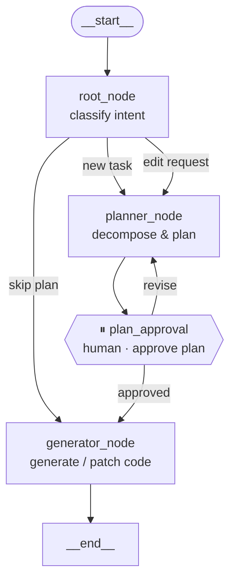

```mermaid
flowchart TD
    S(["__start__"]) --> root_node

    root_node["root_node\nclassify intent"]
    root_node -->|new task| planner_node
    root_node -->|edit request| planner_node
    root_node -->|skip plan| generator_node

    planner_node["planner_node\ndecompose & plan"]
    planner_node --> plan_approval

    plan_approval{{"⏸ plan_approval\nhuman · approve plan"}}
    plan_approval -->|approved| generator_node
    plan_approval -->|revise| planner_node

    generator_node["generator_node\ngenerate / patch code"]
    generator_node --> __end__
```
    

   